# Knowledge_Base
My Knowledge Base about working of web applications

## The Complete Web Request Flow Diagram 
- Assumptions
-   * I have hosted my backend server deployed on Render
    * I used Cloudflare as a Managed Reverse Proxy.

```mermaid
sequenceDiagram
    autonumber
    participant User as 🌐 User Browser
    participant DNS as 📔 DNS (Cloudflare Nameservers)
    participant CF_Edge as 🛡️ Cloudflare Edge (WAF/Proxy)
    participant ISP as 🛣️ Internet Routing (BGP/TCP)
    participant Render_LB as ⚖️ Render Load Balancer (Nginx/Envoy)
    participant API_GW as 🚪 API Gateway (Logic Layer)
    participant App as 💻 Your App Code (Node/Python/Go)
    participant DB as 🗄️ Database

    Note over User, DNS: Phase 1: Address Discovery
    User->>DNS: Where is "myapp.com"?
    DNS-->>User: Go to Cloudflare IP (104.x.x.x)

    Note over User, CF_Edge: Phase 2: The Security Shield
    User->>CF_Edge: HTTP GET Request (Encrypted TLS)
    CF_Edge->>CF_Edge: Check Firewall (WAF) & Bot Detection
    CF_Edge->>CF_Edge: Is this page cached? (If yes, return now)

    Note over CF_Edge, Render_LB: Phase 3: The Hand-off
    CF_Edge->>Render_LB: Forward Request to Render Origin
    Render_LB->>Render_LB: SSL Termination (Decrypts HTTPS)

    Note over Render_LB, API_GW: Phase 4: Internal Routing
    Render_LB->>API_GW: Which service handles "/api/users"?
    API_GW->>API_GW: Check Auth Header (JWT/API Key)
    API_GW->>API_GW: Rate Limiting (Is user spamming?)

    Note over API_GW, DB: Phase 5: The Brains
    API_GW->>App: Forward to Private Port (e.g., :3000)
    App->>DB: SQL Query: "SELECT * FROM users"
    DB-->>App: User Data
    App-->>API_GW: JSON Response

    Note over API_GW, User: Phase 6: The Return Trip
    API_GW-->>Render_LB: Response Data
    Render_LB-->>CF_Edge: Compressed Data (Gzip/Brotli)
    CF_Edge-->>User: Secure Webpage Displayed
```
      

